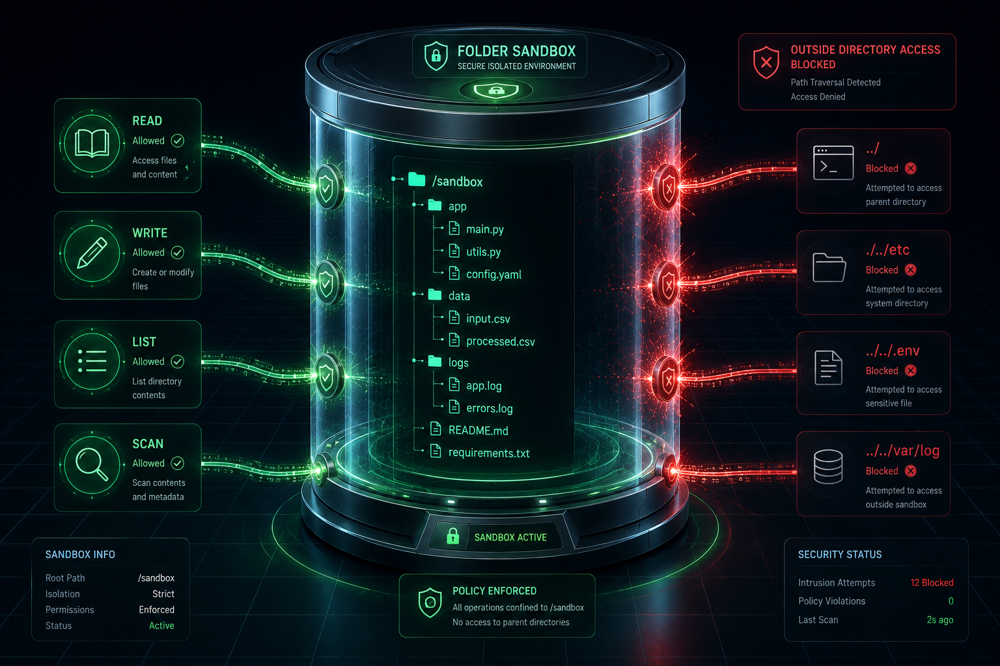
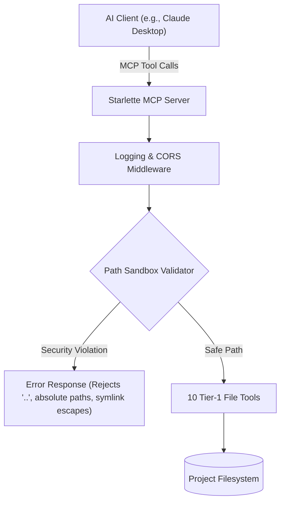

# 🤖 Code Copilot MCP Server

[](https://www.python.org/)
[](https://github.com/modelcontextprotocol/python-sdk)
[](https://www.starlette.io/)
[](https://www.uvicorn.org/)
[](https://opensource.org/licenses/MIT)

<p align="center">
  
  <br>
  <em>Secure Model Context Protocol sandbox controller with file inspection metrics</em>
</p>

An enterprise-ready **Model Context Protocol (MCP)** server that gives LLM assistants (such as Claude Desktop or cursor) secure, read-write access to a single designated project folder. Built with **FastMCP v2** and **Starlette / Uvicorn**, it implements middleware safeguards and path validators to protect against system traversal.

---

## 🏗️ Architecture & Security Model

The server acts as a validated bridge between an external AI client and your filesystem:



### Sandbox Protections:
* **Relative Path Checks**: Absolute paths are blocked.
* **Directory Traversal Blocking**: Any path components containing `..` are explicitly rejected.
* **Symlink Escaping Protection**: Resolves all symbolic links using `Path.resolve()` and checks that the resolved target path begins with the designated `PROJECT_ROOT` prefix.

---

## 🛠️ Tool Registry

The server registers 17 high-performance tools:
1. `read_file`: Reads files safely (supports start_line/end_line line ranges for token optimization).
2. `batch_read_files`: Reads up to 10 files in a single tool call to minimize context round-trips.
3. `write_file`: Creates or overwrites files (guides AI to create with content directly).
4. `create_file`: Lightweight placeholder creator (creates empty files only).
5. `modify_file`: Surgical edit tool replacing specific text blocks (supports quote preservation, bounds, and read-staleness checks).
6. `undo_edit`: Single-level undo reverting the last edit made to a file.
7. `list_files`: Lists directory contents with filters.
8. `get_file_structure`: Generates a nested directory tree of the project.
9. `search_in_files`: Runs regex/text searches.
10. `grep_search`: Ripgrep-like search returning matches with surrounding context lines.
11. `find_function`: Extracts function and class definitions.
12. `find_references`: Scans for symbol references across the project.
13. `get_file_info`: Retrieves size, encoding, language, and modification time.
14. `analyze_file`: Calculates code structure metrics and complexity.
15. `get_diagnostics`: Lightweight syntax validation for Python, JSON, and JS.
16. `execute_command`: Secure, whitelisted command executor inside the project sandbox (pytest, git, python, npm).
17. `set_project_root`: Dynamically switches the active project root directory at runtime.

---

## 📁 Repository Directory Structure

```text
MCP-Code-Copilot/
├── middleware/
│   ├── security.py           # Path validation and sandbox rules
│   └── logging.py            # Event logging middleware
├── tools/
│   └── file_operations.py    # All 10 file tools
├── utils/
│   ├── encoding_detector.py  # chardet-based encoding detection
│   ├── file_validator.py     # Helpers (binary checks, size calculations)
│   └── error_handler.py      # Standardised error responses
├── prompts/
│   ├── skills.md             # System instructions for AI client
│   └── image_prompt_MCP_Code_Copilot.md # ChatGPT design prompts
├── config.py                 # Configuration constants
├── requirements.txt          # Python dependencies
└── server.py                 # Starlette web server entry point
```

---

## 🚀 Installation & Quick Start

### 1. Install using Pip (CLI Mode)
You can install the server in editable mode so it registers a global command line entry point `mcp-code-copilot`:
```bash
# Run inside the repository directory:
pip install -e .
```

### 2. Launch the Server
Start the server and specify the target sandbox folder path:
```bash
# Using the CLI wrapper directly:
mcp-code-copilot /path/to/your/sandbox/project --port 8000

# Or using python directly:
python server.py /path/to/your/sandbox/project --port 8000
```
```text
============================================================
🚀 Code Copilot MCP Server  v2.0.0
============================================================
  Project : my-project
  MCP     : http://127.0.0.1:8000/mcp
  Health  : http://127.0.0.1:8000/health
============================================================
```

### 3. Register with Claude Desktop
Add the server config parameters to your `claude_desktop_config.json`:
```json
{
  "mcpServers": {
    "code-copilot": {
      "url": "http://127.0.0.1:8000/mcp"
    }
  }
}
```
