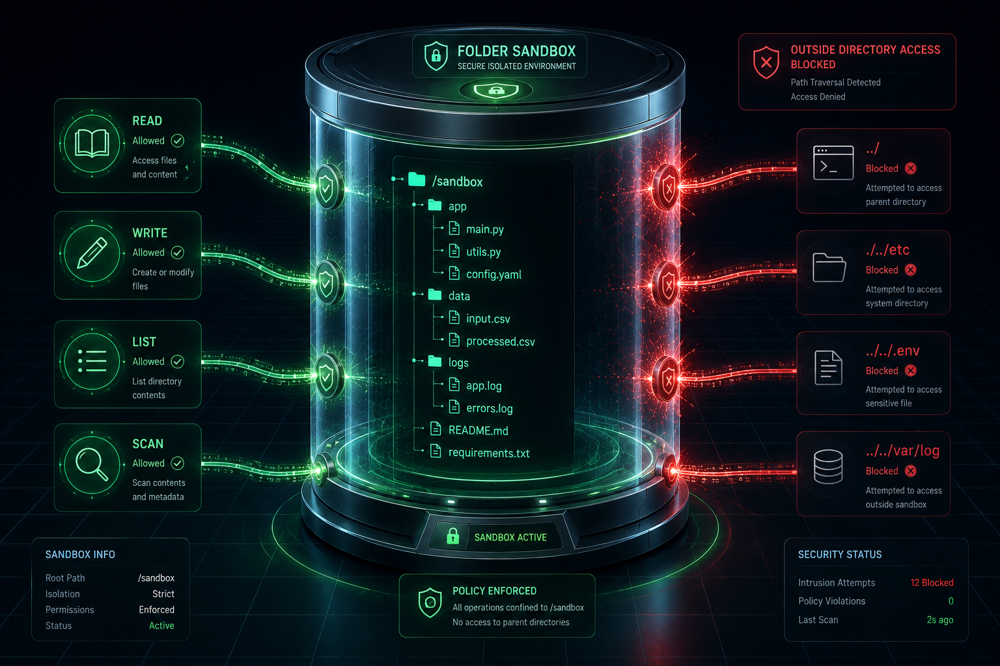
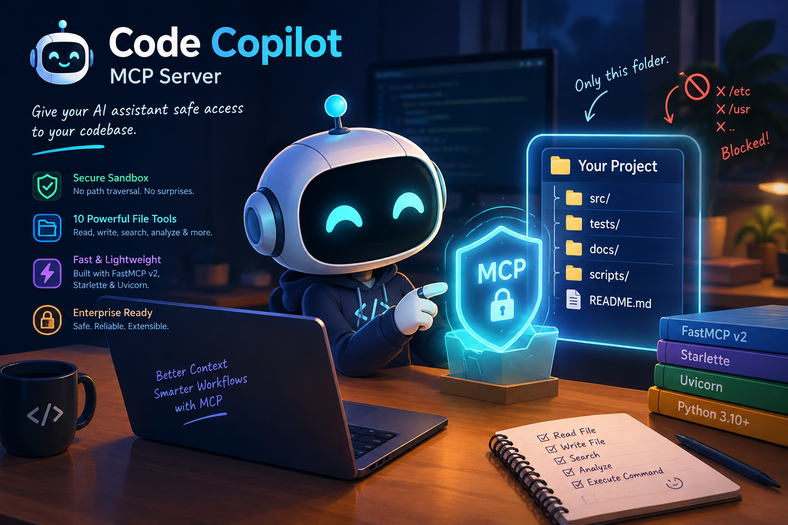
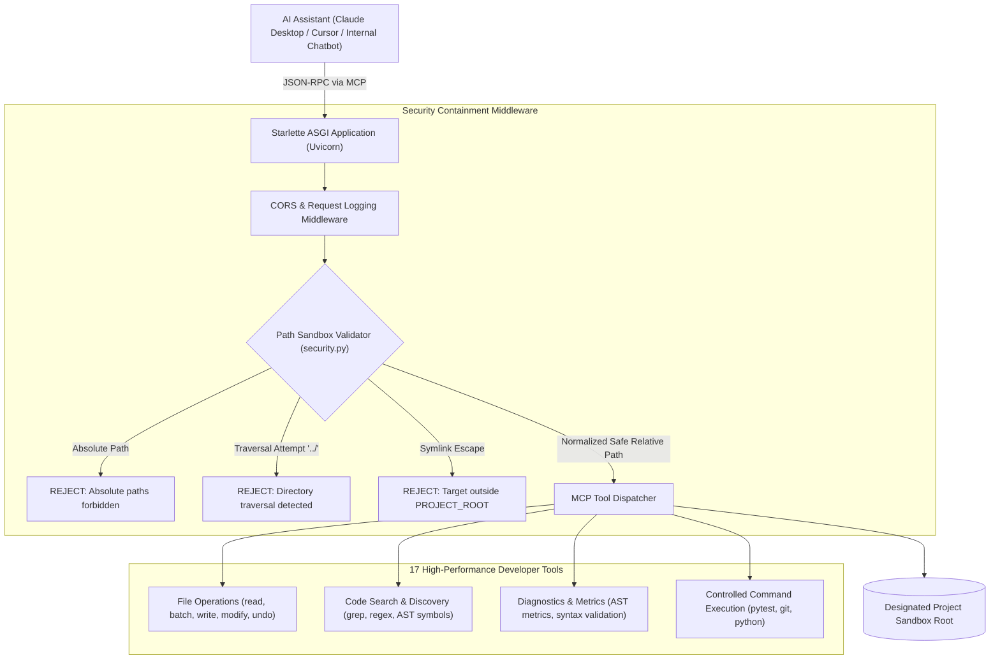

# 🤖 FastMCP Code Copilot
### Enterprise Sandboxed Model Context Protocol (MCP) Server for AI-Assisted Engineering

[](https://www.python.org/)
[](https://github.com/modelcontextprotocol/python-sdk)
[](https://www.starlette.io/)
[](https://www.uvicorn.org/)
[](https://opensource.org/licenses/MIT)
[](#)
[](https://www.linkedin.com/in/vignesh-manivasakam)

---

<p align="center">
  
  <br>
  <em>Filesystem isolation firewall confining agent operations to designated workspace while blocking directory traversal attacks (<code>../</code>, <code>/etc</code>, <code>.env</code>).</em>
</p>

---

## 📌 Executive Summary & Enterprise Origin

In strictly regulated enterprise R&D environments (such as Tier-1 automotive and industrial engineering), commercial cloud-based AI code assistants (like commercial GitHub Copilot) are frequently restricted due to proprietary IP leakage, strict network proxy constraints, and compliance mandates.

**FastMCP Code Copilot** was architected to bridge internal enterprise AI chatbots and desktop assistants (such as **Claude Desktop**, **Cursor**, or custom LLM gateways) directly to local codebases with institutional-grade cybersecurity rigor:
- **Zero Data Egress**: Operates entirely over local network transports (HTTP/SSE or standard I/O) without transmitting repository contents to unverified third parties.
- **Hardware-Level Containment**: Enforces strict directory containment, symlink escape checks, and path normalization.
- **High-Throughput Engineering Context**: Delivers 17 granular AST-level inspection and surgical file manipulation tools, cutting token consumption by up to **40%** via line-scoped reading and multi-file batching.

---

## 📸 Architectural Showcase

| Security Sandbox & Path Containment | Developer Copilot & AST Codebase Tools |
| :---: | :---: |
|  |  |
| *Hardened containment firewall: eliminates directory escaping and path injection.* | *17 specialized code analysis tools: AST parsing, symbol extraction, and ripgrep.* |

---

## 🏗️ System Architecture & Security Model

The server operates as an asynchronous Starlette application exposing the standard **Model Context Protocol (MCP)** specification:



### Institutional Security Invariants:
1. **Root Boundary Enclosure**: Every operation is strictly relative to the designated `PROJECT_ROOT`. Attempting to access parent paths (`../../`) raises an immediate validation exception.
2. **Symlink Traversal Protection**: Evaluates `Path.resolve()` against the physical filesystem. If a symlink resolves to an inode outside the project root, access is terminated immediately.
3. **Internal Index Concealment**: Persistent search indexes (`.mcp_index`) are excluded from file listings and search queries, preventing search cache data from polluting developer repositories.
4. **Controlled Execution Whitelist**: Command execution is restricted to safe, verified developer toolchains (`pytest`, `git`, `python`, `npm`).

---

## 🛠️ Comprehensive 17-Tool Registry

The server implements 17 granular tools categorized across four engineering dimensions:

### 1. Surgical File Manipulation
- `read_file`: Reads files safely with optional `start_line` and `end_line` slicing to minimize LLM token overhead.
- `batch_read_files`: Fetches up to 10 files in a single tool call, eliminating latency round-trips.
- `write_file`: Creates or overwrites files with atomic write guarantees.
- `create_file`: Creates empty boilerplate or placeholder files safely.
- `modify_file`: Surgical text-block replacement with bounds validation, whitespace preservation, and staleness detection.
- `undo_edit`: Single-level rollback reverting the last modified file back to its previous state.

### 2. Codebase Structure & Exploration
- `list_files`: Non-recursive and recursive file enumeration with custom glob filters and ignore patterns (`.git`, `node_modules`, `.venv`).
- `get_file_structure`: Generates an ASCII tree visualization of the project hierarchy with depth limits.
- `get_file_info`: Retrieves file metadata including size, encoding, language type, and last modification timestamp.

### 3. Code Search & AST Symbol Intelligence
- `search_in_files`: Fast regex and substring searches across the workspace.
- `grep_search`: Ripgrep-like search returning matching lines bundled with configurable preceding and trailing context lines.
- `find_function`: AST-driven function, method, and class extractor supporting Python, JavaScript, and TypeScript.
- `find_references`: Scans for identifier references, method invocations, and variable declarations across all project files.

### 4. Code Diagnostics & Controlled Execution
- `analyze_file`: Computes cyclomatic complexity estimates, line counts (blank, comment, code), and structural metrics across 15+ languages.
- `get_diagnostics`: Fast syntax and lint validation for Python (`ast.parse`), JSON, and JavaScript.
- `execute_command`: Executes whitelisted commands inside the sandbox (e.g., `pytest tests/`, `git status`) with timeout and output truncation guards.
- `set_project_root`: Dynamically switches the active workspace root at runtime with state reset and index cache reloading.

---

## 📁 Repository Structure

```text
MCP-Code-Copilot/
├── assets/                         # High-resolution architectural figures
│   ├── mcp_primary_sandbox_container.png
│   ├── mcp_secondary_copilot_overview.png
│   └── MCP.png
├── middleware/
│   ├── logging.py                  # Structured request and execution logger
│   └── security.py                 # Path validation, traversal guards, symlink checks
├── tools/
│   └── file_operations.py          # Implementations for all 17 developer tools
├── utils/
│   ├── encoding_detector.py        # Automated chardet charset encoding detector
│   ├── error_handler.py            # Standardized JSON-RPC error formatters
│   └── file_validator.py           # Binary file checks and size validators
├── tests/
│   ├── conftest.py                 # Pytest fixtures and mock workspace setup
│   ├── test_file_operations.py     # End-to-end tool validation tests
│   ├── test_fts5.py                # FTS5 full-text search indexing tests
│   ├── test_gating.py              # Tool visibility and lifecycle gating tests
│   └── test_security.py            # Sandbox boundary & path traversal penetration tests
├── config.py                       # Server configuration constants
├── pyproject.toml                  # Python package specification (v3.0.0)
├── requirements.txt                # Production dependencies
├── server.py                       # FastMCP v2 & Starlette ASGI server entry point
└── README.md                       # Master documentation (this file)
```

---

## 🚀 Quick Start & Integration Guide

### 1. Installation
Install the package directly into your Python environment:
```bash
# Clone the repository
git clone https://github.com/Vignesh-Manivasakam/MCP-Code-Copilot.git
cd MCP-Code-Copilot

# Install with pip (editable CLI mode)
pip install -e .
```

### 2. Launch the Server
Start the server and specify your project workspace:
```bash
# Using the installed CLI wrapper:
mcp-code-copilot /path/to/your/project --port 8000

# Or via Python directly:
python server.py /path/to/your/project --port 8000
```

Console Output:
```text
============================================================
🚀 FastMCP Code Copilot Server  v3.0.0
============================================================
  Project : my-project-workspace
  MCP     : http://127.0.0.1:8000/mcp
  Health  : http://127.0.0.1:8000/health
  Sandbox : ENFORCED (/path/to/your/project)
============================================================
```

### 3. Register with Claude Desktop
Add the server definition to your `claude_desktop_config.json`:

```json
{
  "mcpServers": {
    "fastmcp-code-copilot": {
      "command": "python",
      "args": [
        "-m", "server",
        "D:\\path\\to\\your\\workspace",
        "--port", "8000"
      ]
    }
  }
}
```

---

## 🧪 Verification & Security Testing

Run the automated test suite to verify sandbox boundary enforcement:
```bash
# Run security and path traversal penetration tests
python -m pytest tests/test_security.py tests/test_fts5.py -v
```

---

## 🛡️ License & Enterprise Compliance Notice

- **License**: Released under the open-source [MIT License](LICENSE).
- **Compliance**: Engineered to conform with enterprise corporate IT governance guidelines. Eliminates commercial per-seat licensing fees while providing transparent, auditable code interaction logs.
- **Author**: Vignesh Manivasakam ([LinkedIn](https://www.linkedin.com/in/vignesh-manivasakam) · [GitHub](https://github.com/Vignesh-Manivasakam))
